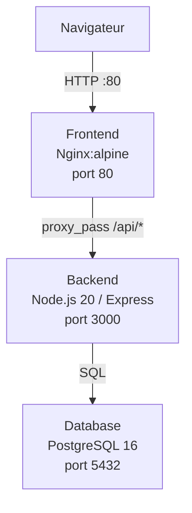

# VitalSync

Application de suivi médical et sportif — projet de démonstration d'une chaîne CI/CD conteneurisée complète.

## Architecture



La stack est composée de trois services :

| Service | Image | Rôle |
|---|---|---|
| `frontend` | `nginx:alpine` | Sert `index.html` et proxifie les requêtes `/api/*` vers le backend |
| `backend` | `node:20-alpine` (multi-stage) | API REST Express exposant `/health`, `/api/activities`, `/api/users` |
| `database` | `postgres:16-alpine` | Stockage persistant des données |

---

## Prérequis

| Outil | Version minimale |
|---|---|
| Docker | 24+ |
| Docker Compose | 2.20+ |
| Node.js | 20 (pour le développement local uniquement) |
| Git | 2.40+ |

---

## Lancer l'application en local

### 1. Cloner le dépôt

```bash
git clone https://github.com/Vincentlbl/vitalsync.git
cd vitalsync
```

### 2. Configurer les variables d'environnement

```bash
cp .env.example .env
# Éditer .env avec vos valeurs
```

### 3. Démarrer les services

```bash
docker compose up -d
```

### 4. Vérifier que tout tourne

```bash
docker ps
# Frontend accessible sur http://localhost
# Backend accessible sur http://localhost:3000/health
```

### 5. Arrêter les services

```bash
docker compose down
# Pour supprimer aussi les données PostgreSQL :
docker compose down -v
```

---

## Pipeline CI/CD

La pipeline GitHub Actions (`.github/workflows/ci.yml`) comporte 3 étapes séquentielles :

```
push develop
     │
     ▼
┌─────────────┐    ┌──────────────────────┐    ┌─────────────────┐
│ Lint & Tests│───▶│ Build & Push (GHCR)  │───▶│ Deploy Staging  │
│ ESLint + Jest│   │ SHA tag + latest tag  │    │ docker-compose  │
│             │    │                      │    │ + health check  │
└─────────────┘    └──────────────────────┘    └─────────────────┘
```

- **Déclencheur push `develop`** : les 3 étapes s'exécutent.
- **Déclencheur PR vers `main`** : lint & tests uniquement (pas de push registry).

---

## Choix techniques

| Choix | Justification |
|---|---|
| `node:20-alpine` | Image LTS minimale (~170 Mo vs ~1 Go pour Debian) — moins de CVE, surface d'attaque réduite |
| Multi-stage build | Stage 1 exécute les tests (porte de qualité), stage 2 produit une image de production légère sans outils de dev |
| `nginx:alpine` | Serveur statique éprouvé, ~25 Mo, proxy inverse natif pour éviter les problèmes CORS |
| `postgres:16-alpine` | Version LTS stable, image Alpine pour la légèreté |
| GHCR | Registry intégré à GitHub — authentification via `GITHUB_TOKEN` automatique, aucun secret supplémentaire |
| Tag SHA commit | Traçabilité immuable : chaque image correspond exactement à un commit, rollback précis possible |
| Réseau bridge dédié | Isolation des conteneurs du projet, résolution DNS par nom de service |
| Volume nommé PostgreSQL | Les données survivent aux `docker compose down` — seul `down -v` les supprime |
| Secrets GitHub Actions | Les valeurs sensibles sont chiffrées au repos, masquées dans les logs, jamais exposées dans le code |
